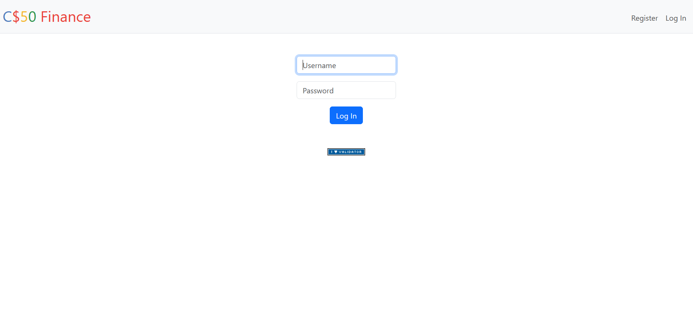
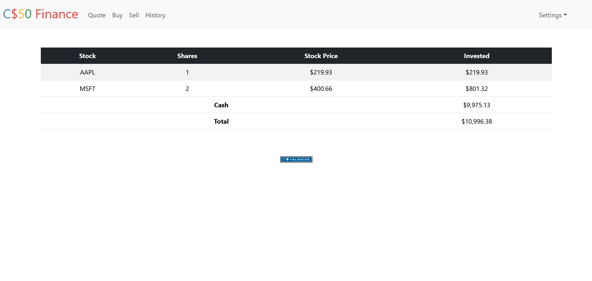
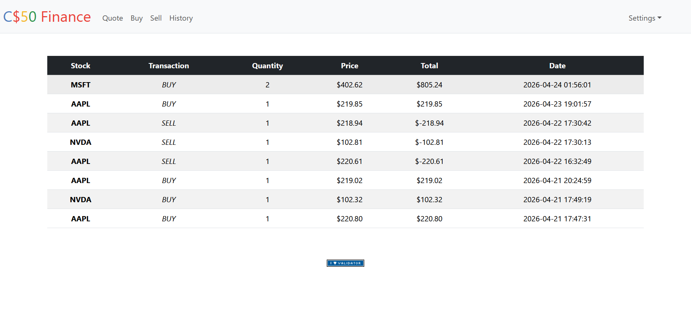
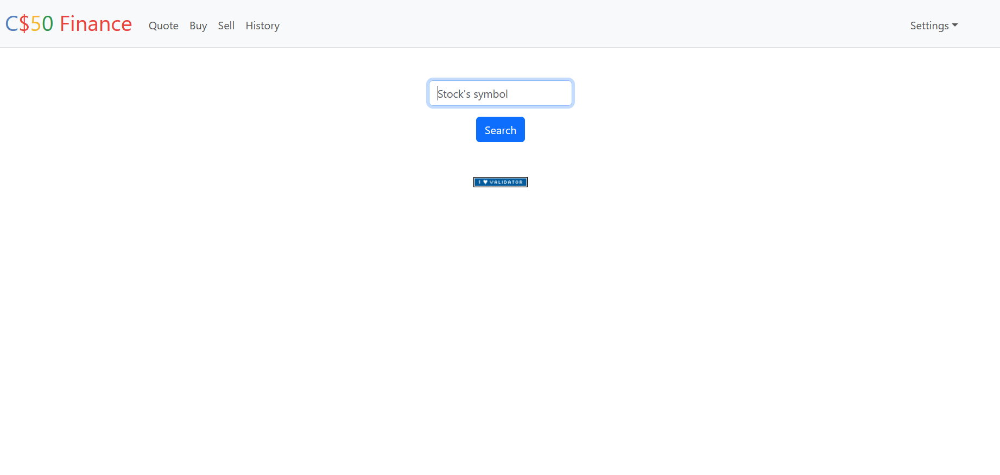
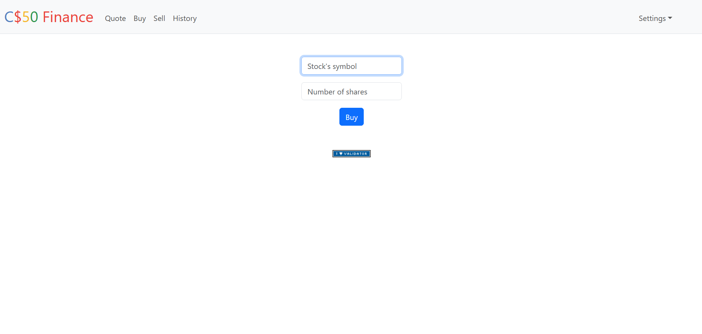
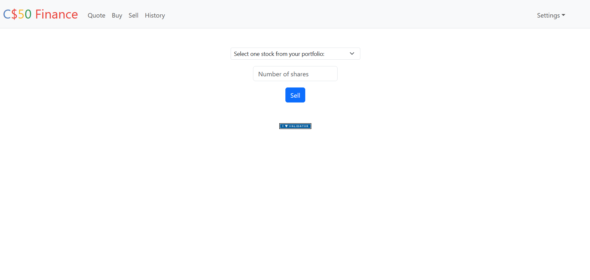
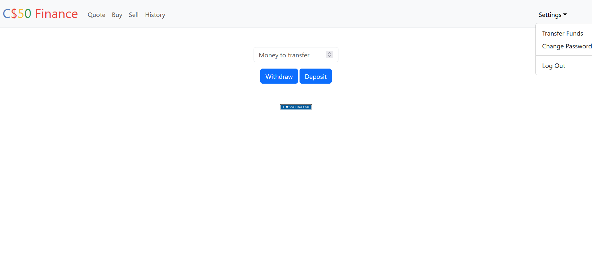
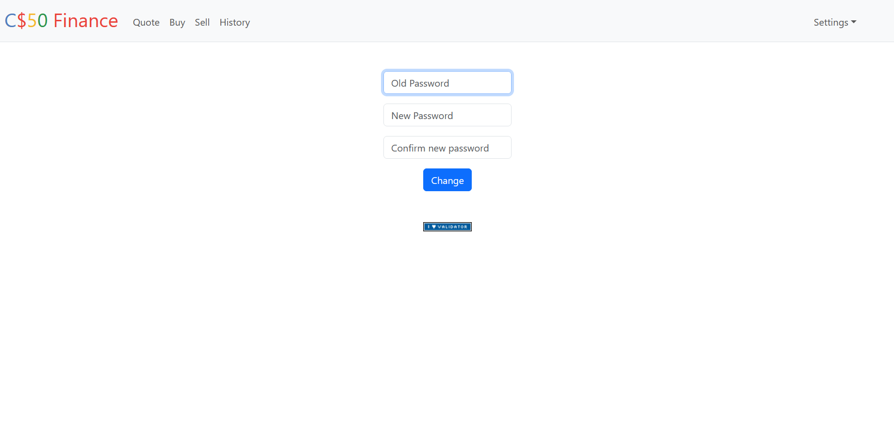

#    CS50 Finance:

- This is a web application that simulates stock trading, built as part of Harvard's CS50 course .


#      Features:

- User authentication (register, login, logout)
- Real-time stock quotes grabbing via API
- Buying and selling stocks
- Portfolio tracking
- Consulting transaction history
- Add/withdraw funds
- Password management


#     Tech Stack:

- **Backend**: Python, Flask
- **Frontend**: HTML, CSS (Bootstrap)
- **Database**: SQLite
- **Authentication**: Hashing using `werkzeug.security`
- **API**: CS50 `lookup()` helper (stock prices)


#   Project Structure:

```
finance/
│
├── app.py              # Main Flask application
├── helpers.py          # Helper functions (login_required, lookup, etc.)
├── finance.db          # SQLite database
│
├── templates/          # HTML templates (Jinja)
│   ├── layout.html
│   ├── index.html
│   ├── buy.html
│   ├── sell.html
│   ├── quote.html
│   ├── history.html
│   ├── register.html
│   ├── login.html
│   ├── change.html
│   └── transfer.html
│
├── static/             # CSS, images, etc.
│   └── styles.css
│
└── README.md
```


#  Setup Instructions:

1. Clone the repository:

   ```bash
   git clone https://github.com/MiguelGarcia16/cs50-finance.git
   cd cs50-finance
   ```

2. Install dependencies:

   ```bash
   pip install flask cs50
   ```

3. Run the application:

   ```bash
   flask run
   ```

4. Open your browser:

   ```
   http://127.0.0.1:5000/
   ```


#    Screenshots:











# Notes:

- This project is for educational purposes only.
- Not intended for real financial use.

  
# What I Learned:

- Building full-stack web applications with Flask
- Handling user authentication securely
- Interacting with databases using SQL
- Structuring a scalable backend
- Debugging and validating user input
- Integrating external APIs


# Author:

Miguel Garcia

GitHub: https://github.com/MiguelGarcia16
